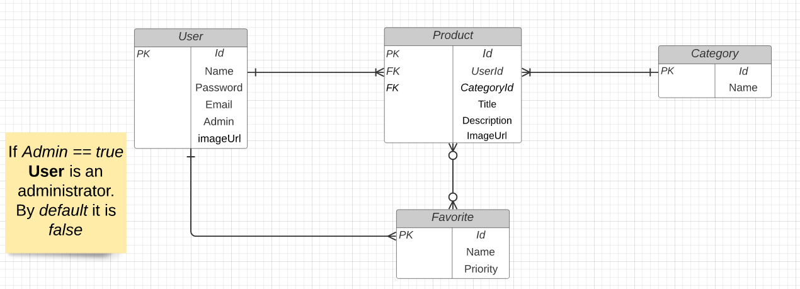
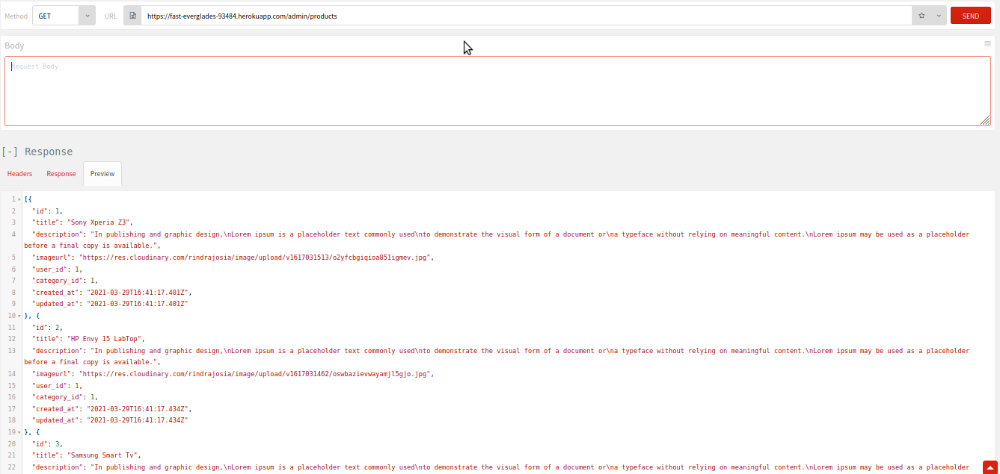
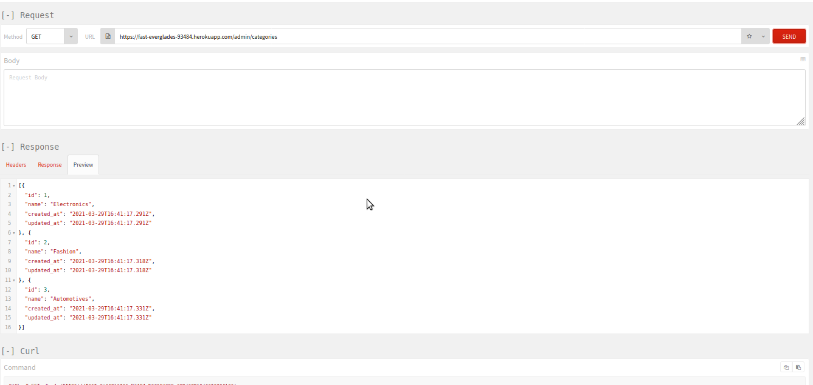

# Backend: Final Capstone Project

This project is about Final Capstone Project based on a find your house app. It's a real-world-like project, built with business specifications. In this branch, I built an API.

Technical mandatory requirements of the project:

* This project has 5 tables
* Postgres is used as database


## API documentation:
| URL                                                                     | Method | Description                                          |
|-------------------------------------------------------------------------|--------|------------------------------------------------------|
| https://fast-everglades-93484.herokuapp.com/auth/login                  | POST   | Authentication                                       |
| https://fast-everglades-93484.herokuapp.com/signup                      | POST   | Signup                                               |
| https://fast-everglades-93484.herokuapp.com/admin/categories            | GET    | Show a list of all categories                        |
| https://fast-everglades-93484.herokuapp.com/admin/categories/id         | PUT    | Edit a specific category                             |
| https://fast-everglades-93484.herokuapp.com/admin/categories/id         | DELETE | Delete a specific favourite                          |
| https://fast-everglades-93484.herokuapp.com/admin/favorites             | GET    | Show a list of all favourites for a specific user    |
| https://fast-everglades-93484.herokuapp.com/admin/favorites             | POST   | Create a new favourite                               |
| https://fast-everglades-93484.herokuapp.com/admin/favorites/id          | DELETE | Delete a specific favourite                          |
| https://fast-everglades-93484.herokuapp.com/admin/products              | GET    | Show a list of all products                          |
| https://fast-everglades-93484.herokuapp.com/admin/products/id           | GET    | Show a specific product                              |
| https://fast-everglades-93484.herokuapp.com/admin/products              | POST   | Create a new product                                 |
| https://fast-everglades-93484.herokuapp.com/admin/products/id           | PUT    | Edit a specific product                              |
| https://fast-everglades-93484.herokuapp.com/admin/products/id           | DELETE | Delete a specific product                            |


## Built With

- Ruby v2.7.2
- Ruby on Rails v5.2.4

## ERD



## Screenshot




## Live Demo

https://wonderful-franklin-57328e.netlify.app

## Getting Started

* You can get a local copy of the repository please run the following commands on your terminal:s

$ cd < folder >

$ git clone https://github.com/rindrajosia/final.git

$ git checkout backend

* You need to install the required gems:

$ bundle install

* Create database

$ rails db:create

* Migrate the database

$ rake db:migrate

* To seed the database

$ rails db:seed

* And run the server:

$ rails server

#### Test unit

 Open the project folder with the terminal and run ```bundle exec rspec```


## Author

👤 **Rindra josia**

* Github: **[@rindrajosia](https://github.com/rindrajosia)**
* Twitter: **[@rindrajosia](https://twitter.com/josia_rindra)**
* Linkedin: **[linkedin](https://www.linkedin.com/in/rindra-josia-99b2111a2/)**

## 🤝 Contributing

Contributions, issues and feature requests are welcome!

Feel free to check the [issues page](https://github.com/rindrajosia/final/issues).

## Show your support

Give a ⭐️ if you like this project!

## Acknowledgments

 - Project from Microverse
