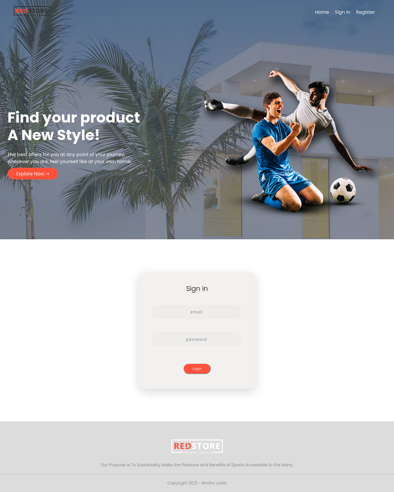
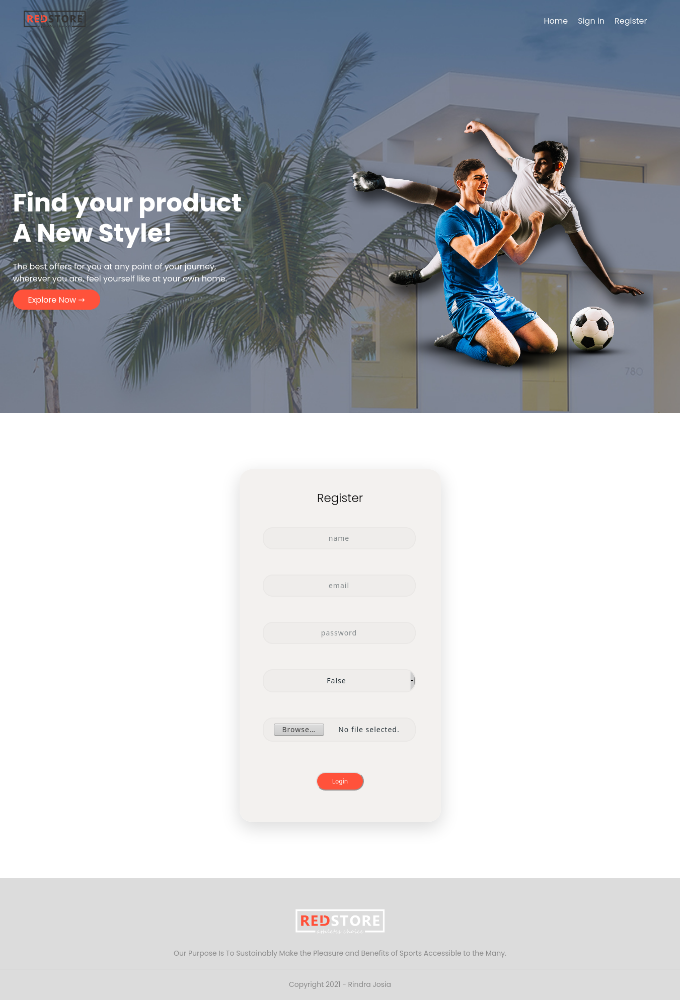
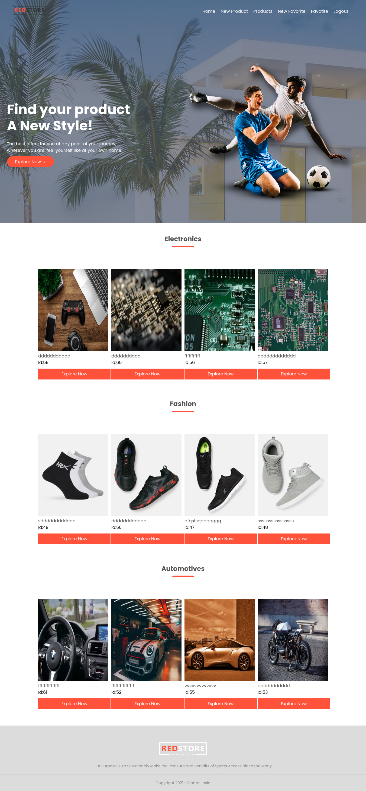

# Final Capstone Project
This project is based on a catalogue of products. It's a real-world-like project, built with business specifications.

This webapp has 12 types of pages:
* Logn page (for administrator, you can use email: 'rrindrajosia@gmail.com', password: '123456789' and for simple user you can use email: 'marina@gmail.com', password: 'marina')
* Register page
* List of products page
* Create product page
* Edit product page
* Delete product page
* List of favorites page
* Create favorite page
* Edit favorite page
* Delete favorite page
* List of products in one favorite page
* Add product in one favorite page

## Built With
* HTML and JSX
* React
* CSS
* ES6

## Getting Started:

To get a local copy up and running follow these simple example steps:

1. Under the repository name, click the Clone or download green button.

2. Copy the URL given by clicking the clipboard button.

3. Open a terminal window in your local machine and change the current directory to the one you
   want the clone directory to be made.

4. Type  git clone and then paste the URL you previously copied to the clipboard.

5. Open a new terminal window in your local machine and change the current directory to your
   cloned directory.

6. Run `npm install` / `npm i` from the Terminal.

7. after that `npm run build` from the terminal.

8. Finally `npm start`.

## Testing :

$ npm t

## See a live demo [Here](https://wonderful-franklin-57328e.netlify.app)

## Show your support
Give a ⭐️ if you like this project!

# Screenshot

* 
* 
* 

## Authors

👤 **Rindra josia**

* Github: **[@rindrajosia](https://github.com/rindrajosia)**
* Twitter: **[@rindrajosia](https://twitter.com/josia_rindra)**
* Linkedin: **[linkedin](https://www.linkedin.com/in/rindra-josia-99b2111a2/)**

## 🤝 Contributing

Contributions, issues and feature requests are welcome!

Feel free to check the [issues page]https://github.com/rindrajosia/final/issues).
